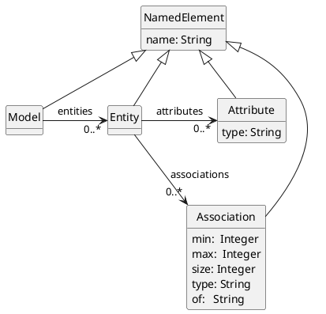
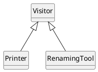

# META-minispec

```plantuml
@startuml
skinparam monochrome true
skinparam shadowing false
skinparam classAttributeIconSize 0

class NamedElement {
  name: String
}

class Model {
}

class Entity {
}

class Attribute {
  type: String
}

class Association {
  min:  Integer
  max:  Integer
  size: Integer
  type: String
  of:   String
}


NamedElement <|-- Model
NamedElement <|-- Entity
NamedElement <|-- Attribute
NamedElement <|-- Association

Model -right-> "0..*" Entity : entities
Entity -right-> "0..*" Attribute: attributes
Entity -down-> "0..*" Association: associations

hide circle
hide methods
@enduml
```

```plantuml
@startuml
skinparam monochrome true
skinparam shadowing false
skinparam classAttributeIconSize 0
class Visitor {
}

class Printer {
}

class RenamingTool {
}

Visitor <|-- Printer
Visitor <|-- RenamingTool
hide circle
hide methods
@enduml
```
